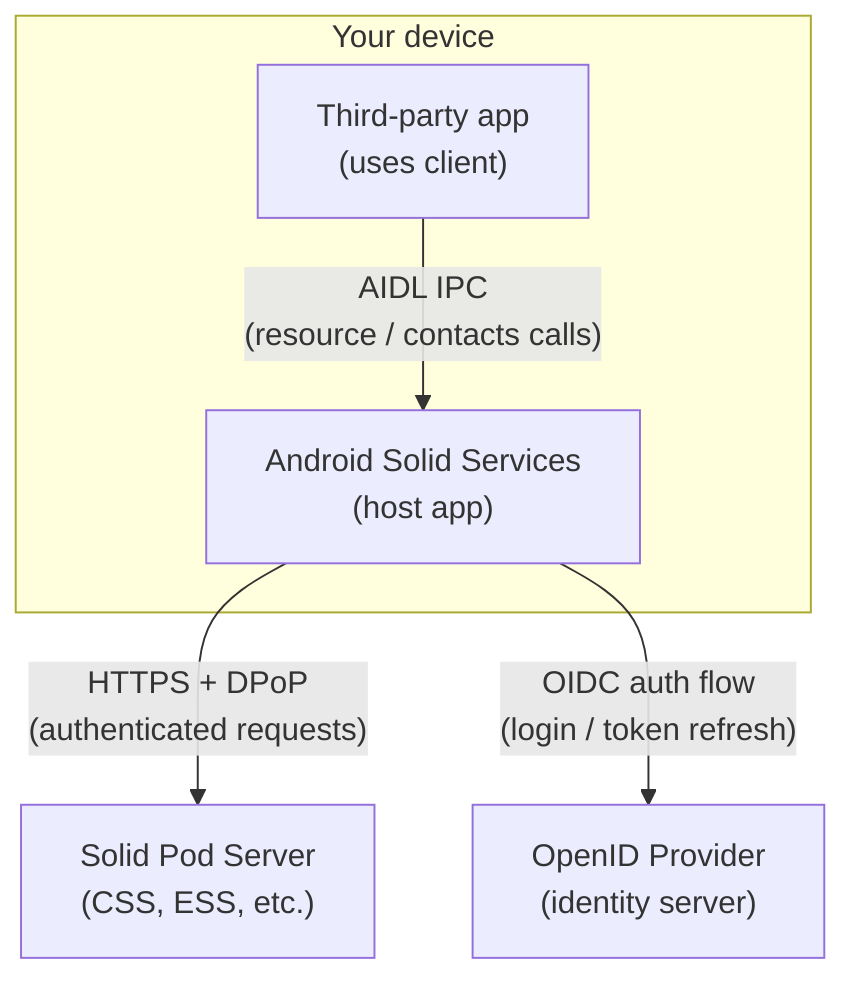
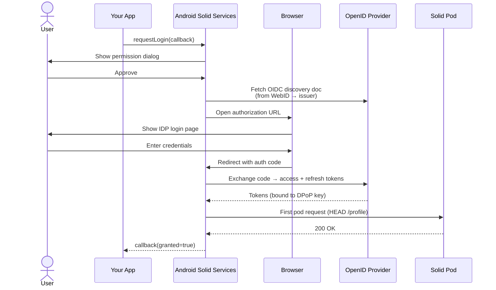
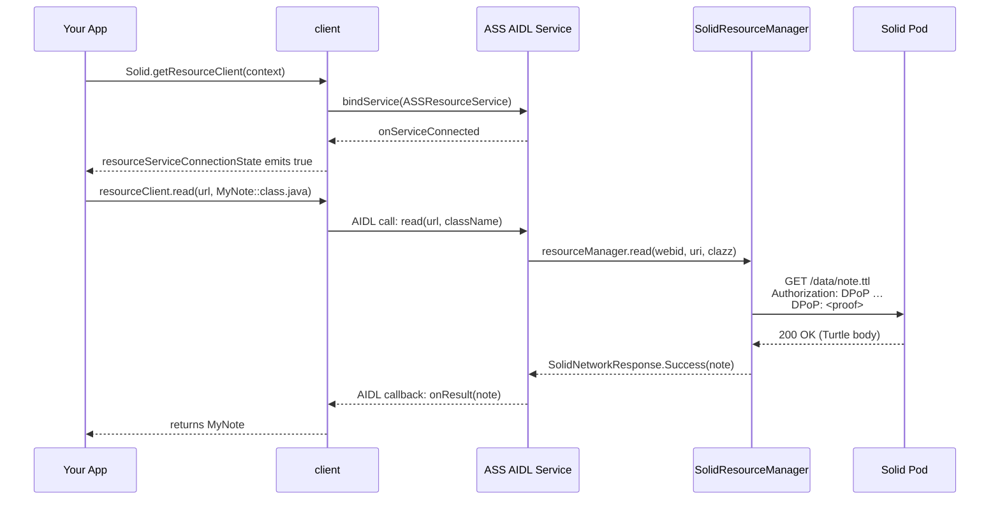
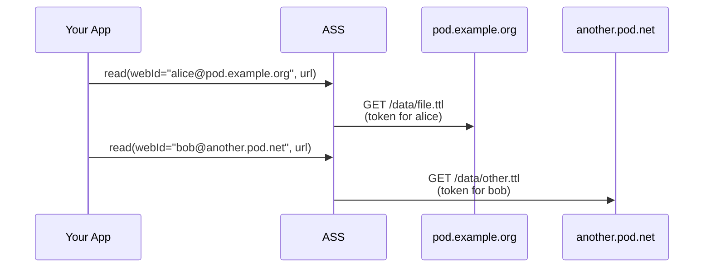
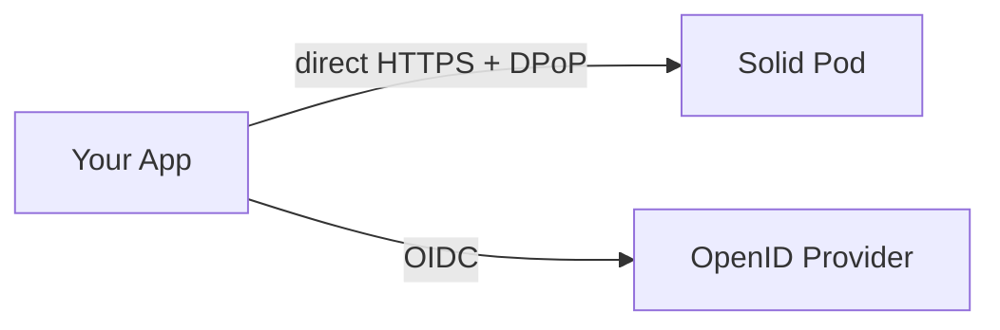
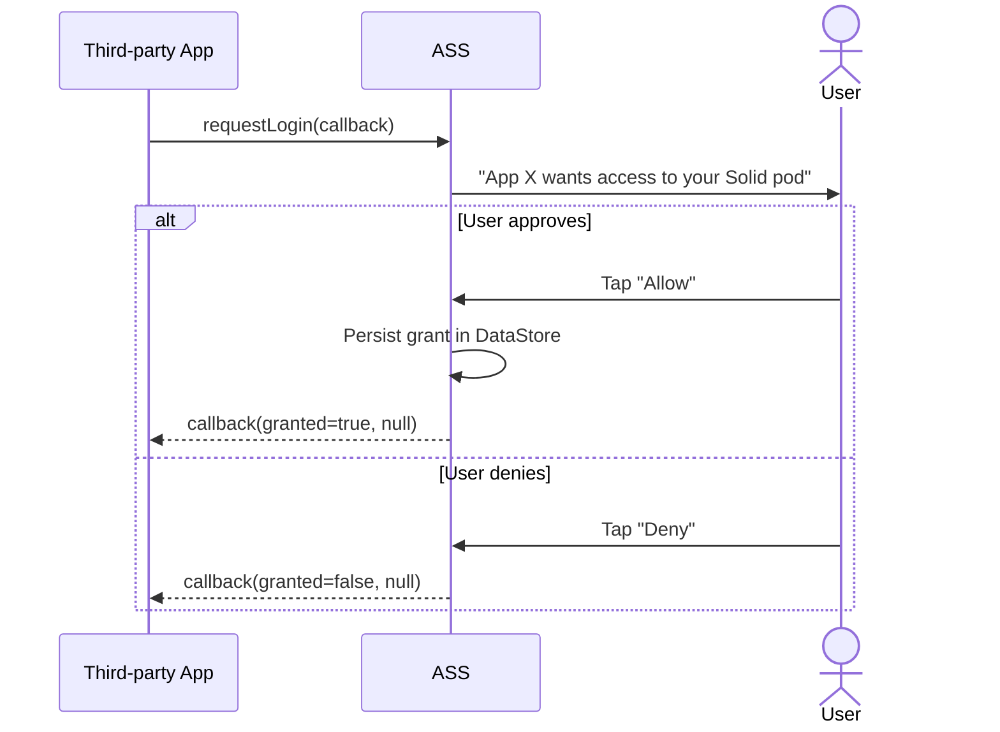

# How It Works

This page walks through how Android Solid Services works at runtime — from a user logging in to a third-party app reading a pod resource. Understanding this helps you build apps that integrate correctly and handle edge cases gracefully.

---

## The Three-Layer Model

Your app **never talks directly to the pod**. It calls the ASS host app over Android IPC (AIDL), which holds the tokens and makes all authenticated HTTP requests on its behalf.

This design has two benefits:

- **Single sign-in** — the user logs in once; every app on the device reuses the same session.
- **Credential isolation** — access tokens never leave the ASS process; third-party apps cannot exfiltrate them.

---

## Authentication Flow

The login flow runs once per Solid account. ASS orchestrates the full OpenID Connect exchange with DPoP:

After login, ASS stores the tokens (access + refresh) in DataStore with Protobuf. Tokens are tied to the DPoP key pair that ASS holds; a stolen token is useless without the private key.

---

## DPoP: Why Tokens Are Bound to the App

Solid servers require [DPoP (Demonstration of Proof-of-Possession)](https://datatracker.ietf.org/doc/html/rfc9449). Every HTTP request carries two headers:

| Header | Content |
|--------|---------|
| `Authorization: DPoP <token>` | The access token issued by the IDP |
| `DPoP: <proof>` | A short-lived JWT, signed with a private key ASS generated at first launch, binding the token to this specific request (method + URI + timestamp) |

If the server returns a `DPoP-Nonce` header, ASS incorporates it into the next proof — preventing replay attacks. This negotiation happens automatically; your app doesn't need to know about it.

---

## IPC: How Your App Calls ASS

The `client` library binds to three Android services inside the ASS app:

The `Flow<Boolean>` connection state is essential: AIDL binding is asynchronous. Always collect it before calling methods — or you'll get a `SolidServiceConnectionException`.

---

## Multi-Account Routing

Since v0.3.0, ASS manages multiple logged-in Solid accounts. Since v0.4.0, the client library passes the target WebID on every call so ASS can route the request to the correct token set.

Persist the WebID after login: `signInClient.getAccount()?.webId`. Pass it on every subsequent call.

---

## Resource Operations: What Happens Under the Hood

When your app calls `resourceClient.read(url, clazz)`, ASS:

1. Looks up the access token for the given WebID.
2. Refreshes it if expired (using the stored refresh token + a fresh DPoP proof).
3. Issues a `GET` with `Authorization: DPoP` and `DPoP` headers.
4. Parses the response body (Turtle, JSON-LD, or raw bytes) into your data class.
5. Returns `SolidNetworkResponse.Success(data)` or an error variant — never throws.

For `update()` and `patch()`, passing an `ifMatch` ETag from a prior `head()` or `read()` adds conditional write protection: the server rejects the write with `412 Precondition Failed` if someone else changed the resource since you last read it.

---

## Direct API Mode (no host app)

If you use `api` directly (no ASS host app), the flow is the same — but your app owns the auth state:

You call `Authenticator.getInstance(context)` and manage the token lifecycle yourself. Use this when you want a fully self-contained app or when ASS is unavailable.

---

## Access Grant Flow

Before a third-party app can read any resource, ASS requires an explicit grant from the user:

Grants are stored per-app in DataStore and shown in the ASS Settings page. The user can revoke them at any time. Your app can also revoke its own grant by calling `disconnectFromSolid()`.
